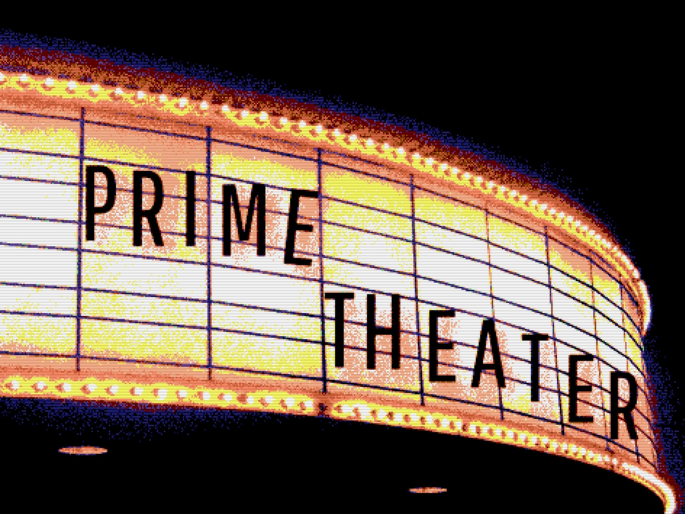

# Prime Theater

## Setup

'npm install'

setup pg databases according to 'database.sql file', all three tables are needed for full functionality

then

'npm run server'

'npm run client'

## Description

This weekend i was instructed to take a repository that was displaying movie titles, images and posters and transform it into 
an interactive application to add and review movies and their related info and genres. I used a series of full stack redux operations, and couple of relational databases to accomplish this. Upon navigating to the home page, a series of movie cards is displayed. Upon clicking a card, the view flips to a details page. This view utilizes react-router-dom URL param techniques to keep data persistent upon refresh. a get is triggered on page load using the /:id portion of the url. Genres for a selected movie are queried in a similar matter upon page load and mapped over to display. A form to add a movie can be reached by pressing the "+ add movie" button found on any of the views. It brings the user to a form with required inputs for Title, Poster URL, Genre, and description. The genre drop down is populated from a a relational query to the movies_genres junction table and relevant references. 

### Next 
I also plan to add an edit page to enable edit of a movie upon pressing a button on it's card or in the detail view. As part of this, addition of genres will be implemented, as part of that, a checkbox mechanism for ability to select multiple genres will be added. I plan to continue to clean up this repo and continue to comment where appropriate. 

Additional README details can be found [here](https://github.com/PrimeAcademy/readme-template/blob/master/README.md).
